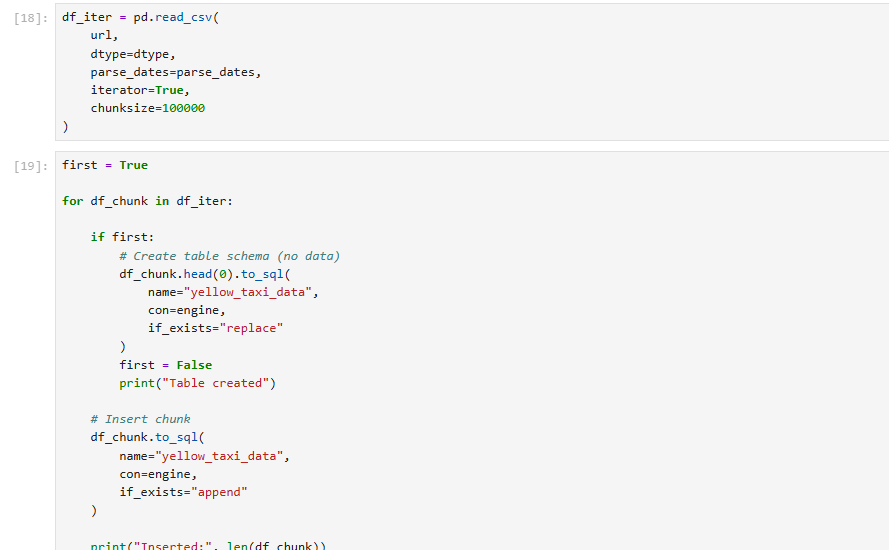
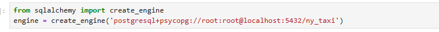

# Module 1 Notes: Containerization and Infrastructure as Code

## Docker

### What Is It?

Docker is a containerization platform that allows applications to run in isolated, lightweight environments called containers. Containers are stateless by default and are isolated from the host system.

### Why Do We Use It?

Docker is widely used in data engineering because many tools and technologies are available as pre-built images that can run consistently across different platforms and hosts.

Benefits:

* **Reproducibility:** Same environment everywhere.
* **Isolation:** Applications run independently from each other and the host.
* **Portability:** Run anywhere Docker is installed.

### How Does It Fit in a Data Pipeline?

* Integration testing in CI/CD pipelines
* Running jobs in the cloud (AWS Batch, Kubernetes Jobs)
* Running Spark workloads for large-scale data processing
* Serverless environments such as AWS Lambda and Google Cloud Functions

---

## Volumes

### What Are They?

A Docker volume is a mechanism that allows containers to read and write data outside the container filesystem.

Volumes provide a way to persist data and make it available beyond the lifetime of a container.

### Why Do We Use Them?

Volumes provide persistent storage. They allow data to survive container recreation and enable file sharing between the host machine and containers.

Because Docker containers are stateless by default, any data stored inside a container is lost when the container is removed. Volumes solve this problem by storing data outside the container.

Types of volumes:

* **Named Volume (`name:/path`)**: Managed by Docker and easier to maintain.
* **Bind Mount (`/host/path:/container/path`)**: Direct mapping to the host filesystem, providing more control.

### How Do They Fit in a Data Pipeline?

* PostgreSQL data
* Airflow metadata
* Kafka logs
* Spark checkpoints
* S3 object caching

Example:

```bash
docker run --rm -v $(pwd):/app test:latest
# This is called a bind mount.
# $(pwd) is the host directory that will be shared with /app inside the container.

docker run --rm -v ny_taxi_data:/var/lib/postgresql/data postgres
# This creates a named volume that persists even after the container exits.
```

Bind mounts are commonly used during development because they allow changes made on the host machine to appear inside the container immediately without rebuilding the image.

---

## Data Pipeline

### What Is It?

A data pipeline is any process that moves data from one location to another while performing transformations or processing along the way.

For example:


---

## Command-Line Arguments (`sys.argv`)

Command-line arguments are values passed to a Python script when it is executed.

Example:

```bash
python3 pipeline.py 2026
```

```python
sys.argv[1]  # 2026
```

---

## Virtual Environments and UV

We use virtual environments to isolate project dependencies because different projects may require different versions of the same package.

**UV** is a modern Python package and project manager written in Rust. It handles virtual environments automatically and is significantly faster than traditional tools.

Example:

```bash
uv init --python=3.13

uv run python -V
# Python 3.13.13

python -V
# Python 3.14.x

uv add pandas pyarrow
# Adds pandas and pyarrow to pyproject.toml and installs them in .venv
```

Or inside Docker:

```dockerfile
# Docker + UV example

# Start with a slim Python 3.13 image
FROM python:3.13.10-slim

# Copy the UV binary from the official image (multi-stage build)
COPY --from=ghcr.io/astral-sh/uv:latest /uv /bin/

# Set working directory
WORKDIR /app

# Add virtual environment to PATH
ENV PATH="/app/.venv/bin:$PATH"

# Copy dependency files first for better layer caching
COPY pyproject.toml uv.lock .python-version ./

# Install dependencies from the lock file
RUN uv sync --locked

# Copy application code
COPY pipeline.py .

# Define container entrypoint
ENTRYPOINT ["uv", "run", "python", "pipeline.py"]
```

Using UV or a virtual environment helps maintain reproducibility and consistency across development environments.

---

## PostgreSQL with Docker

Running PostgreSQL in Docker is straightforward and requires no local installation.

Example:

```bash
docker run -it --rm \
  -e POSTGRES_USER="root" \
  -e POSTGRES_PASSWORD="root" \
  -e POSTGRES_DB="ny_taxi" \
  -v ny_taxi_postgres_data:/var/lib/postgresql/data \
  -p 5432:5432 \
  postgres:18
```


Using a bind mount:

```bash
mkdir ny_taxi_postgres_data

docker run \
  ... \
  -v $(pwd)/ny_taxi_postgres_data:/var/lib/postgresql/data
```

---

## Connecting to PostgreSQL

We can connect to PostgreSQL using **pgcli**, which can be installed as a development dependency using UV:

```bash
# --dev installs the package as a development dependency
uv add --dev pgcli
```

Connect to the database:

```bash
uv run pgcli -h localhost -p 5434 -u root -d ny_taxi
# Enter the password when prompted
```

---

## SQL Refresher

```sql
-- List tables (schema, name, type, owner)
\dt

-- Create a table named test
CREATE TABLE test (
    id INTEGER,
    name VARCHAR(50)
);

-- Insert data
-- Strings use single quotes; double quotes are for identifiers
INSERT INTO test VALUES (1, 'Hello Docker');

-- Retrieve all rows
SELECT * FROM test;

-- Equivalent to:
SELECT id, name FROM test;
```


---

## Ingesting Data

When loading large datasets, it is recommended to process data in chunks (commonly around 100,000 rows at a time) to avoid memory issues and improve performance.

A typical workflow is:

1. Create the destination table.
2. Load and ingest the data in chunks.
3. Append each chunk to the database.

To inspect the schema generated from a DataFrame:

```python
print(
    pd.io.sql.get_schema(
        df,
        name="yellow_taxi_data",
        con=engine
    )
)
```



We used **SQLAlchemy** to establish the connection between Python and PostgreSQL.


