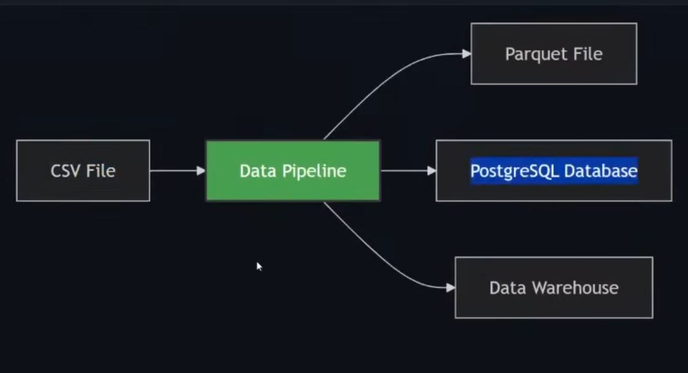
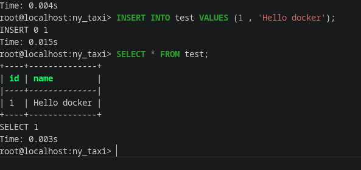

# Module 1 Notes (Containerization and Infrastructure as Code)

## Docker

### What is it?
Stateless containerization software that is isolated from host.
### Why we use it?
Because it contains most data engineering technologies pre-installed and can be easily run on different platforms and hosts. (It is stateless and isiolated meaning it does not store memory )

Reproducibility: Same environment everywhere
Isolation: Applications run independently
Portability: Run anywhere Docker is installed
### How does it fit in a data pipeline?
- Integration tests: CI/CD pipelines
- Running pipelines on the cloud: AWS Batch, Kubernetes jobs
- Spark: Analytics engine for large-scale data processing
- Serverless: AWS Lambda, Google Functions

## Volumes

### What is it?
A volume is a bridge that lets Docker containers read and write files stored outside the container.

Volumes are a way of storing data to preserve it for container use.
### Why we use it?
Volumes provide persistent storage. They allow data to survive container recreation and enable sharing files between the host machine and containers.

Because Docker container are stateless, data will be automatically deleted once we exit the container. Volumes allows for us to be able to still access this saved data and map it to different locations on host machine.

Named volume (name:/path): Managed by Docker, easier
Bind mount (/host/path:/container/path): Direct mapping to host filesystem, more control

### How does it fit in a data pipeline?
- Postgres data
- Airflow metadata
- Kafka logs
- Spark checkpoints
- S3 objects

We may run:
```bash
docker run --rm -v $(pwd):/app test:latest # this is reffered to as a bind mount
# pwd reflects the location where we will share to the container in /app.
docker run --rm -v ny_taxi_data:var/lib/postgresql/data # this creates a storage (or named volume) which will persist even after we exit container.
```
To link the changes we make to the local script copy to the script in the container in real time without needing to rebuiild.

## Data Pipeline

### What is it?
Is any script or similar that takes an input data / dataset and moves it to another location while processesing it along the way. 
For example: 

## Sys Arguments (python)
The arguments that are passed when running the script (sys.argv)

For example:
```bash
python3 pipeline.py 2026
```
```python
sys.argv[1] = 2026
```
## Virtual environments / UV
We use virtual environments to install code dependencies isolated because we might have multiple projects requiring different versions of the same package.

UV is a modern python package and project manager written in Rust and handles virtual environments automatically and super quickly.

For example:
```bash
uv init --python=3.13
uv run python -V
# Python 3.13.13
python -V
# Python 3.14.example
uv add pandas pyarrow
# pandas, pyarrow -> pyproject.toml .venv
```
OR

```dockerfile
# Docker and uv example
# We may be able to get the code running with pip but in order to maintain the code reproducability aspect we are better off using uv or venv

# Start with slim Python 3.13 image
FROM python:3.13.10-slim

# Copy uv binary from official uv image (multi-stage build pattern)
COPY --from=ghcr.io/astral-sh/uv:latest /uv /bin/

# Set working directory
WORKDIR /app

# Add virtual environment to PATH so we can use installed packages
ENV PATH="/app/.venv/bin:$PATH"

# Copy dependency files first (better layer caching)
COPY "pyproject.toml" "uv.lock" ".python-version" ./
# Install dependencies from lock file (ensures reproducible builds)
RUN uv sync --locked

# Copy application code
COPY pipeline.py pipeline.py

# Set entry point
ENTRYPOINT ["uv", "run", "python", "pipeline.py"]
```

## Postgres with Docker
Running Postgres with Docker is very simple and doesn't need any installation steps.
We just have to run it with environment variables.

For example
```bash
docker run -it --rm \
  -e POSTGRES_USER="root" \
  -e POSTGRES_PASSWORD="root" \
  -e POSTGRES_DB="ny_taxi" \
  -v ny_taxi_postgres_data:/var/lib/postgresql \
  -p 5432:5432 \
  postgres:18
```


```bash
# this is howe run it using a bind mount
mkdir ny_taxi_postgres_data

docker run
  .
  .
  . 
  -v $(pwd)/ny_taxi_postgres_data:/var/lib/postgresql \
```
---

## Connecting to Postgres
We can connect to postgres database using pgcli which we can add to our project easily using uv by running:
```bash
# --dev adds the dependencies to the development section in uv which is seperate from production
uv add --dev pgcli
```
Then we can connect to our db:
```bash
uv run pgcli -h localhost -p 5434 -u root -d ny_taxi
# then enter the password
```

## SQL refresher
```sql
-- list tables (schema / name / type / owner)
\dt

-- Create table called test with 2 columns -> (id of type INTEGER , name of type VARCHAR)
CREATE TABLE test(id INTEGER , name VARCHAR(50));

-- Insert data -> single quotes for strings because double quotes refers to column/table names
INSERT INTO test VALUES (1, 'Hello Docker');

-- Retrieving data -> (* is all) equivelant to SELECT id,name FROM test;
SELECT * FROM test;
```


